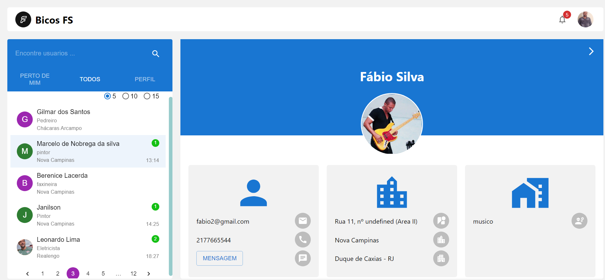
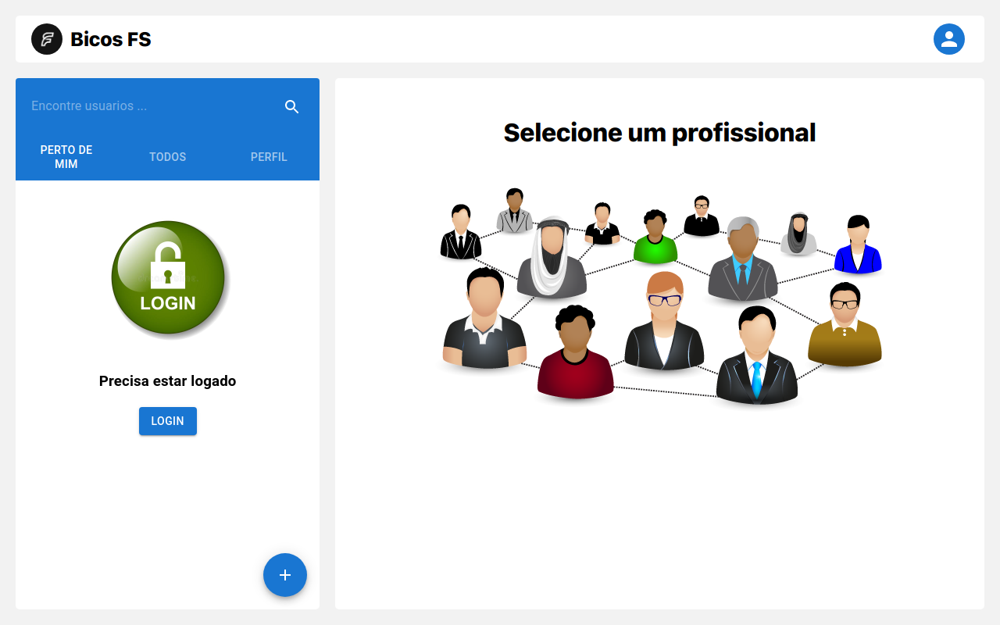
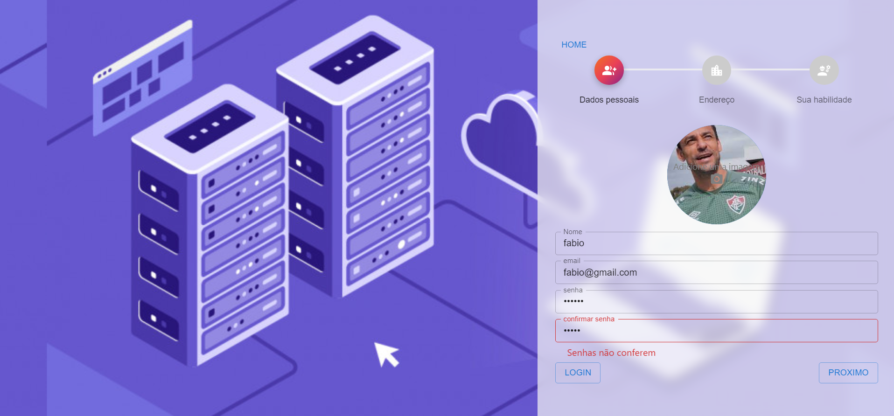
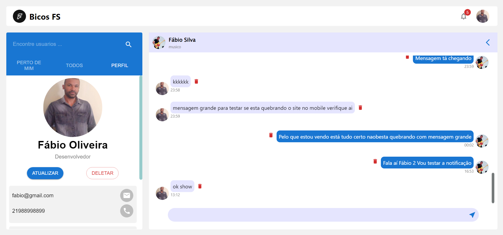

### link https://encontre-profissionais.vercel.app/

#                                                 Finalidade
### O sistema tem como objetivo aproximar os profissionais que fazem "bicos" às pessoas que necessitam. Exemplo: se você precisar de um pintor, é só fazer a busca, encontrar um que more no seu bairro e marcar o serviço.

#                                                 Tecnologias 
### Projeto realizado utilizando as tecnologias React, Material UI, Redux. Foram utilizadas 2 APIs, uma feita por mim com Node e mongoDb Atlas, outra no site do ViaCep para puxar o endereço automaticamente quando inserido o cep na tela de cadastro. 

### Foi utilizado Firebase em duas funcionalidades, a primeira para upload de imagens e a outra para o chat para as conversas serem em realtime.

### Alguns componentes foi utilizado o Typescript para treinamento 

#                                               Funcionalidades

### O sistema permite o usuário entrar na pagina sem estar logado mas com restrições 

### O sistema permite o usuário fazer cadastro com ou sem imagem de perfil, com somente alguma das validações por praticidade, login e as suas validações. Após logado, o usuário consegue visualizar os profissionais que moram no seu bairro

### Após logado, o usuário consegue visualizar os profissionais que moram no seu bairro, ver os seus dados e conversar com ele através do chat. Notificações chegam quando algum profissional (ou cliente), envia uma mensagem. Também é possível alterar dados do usuário, trocar a foto de perfil e excluir a conta. No campo de busca, é possível pesquisar por profissionais por nome ou profissão

